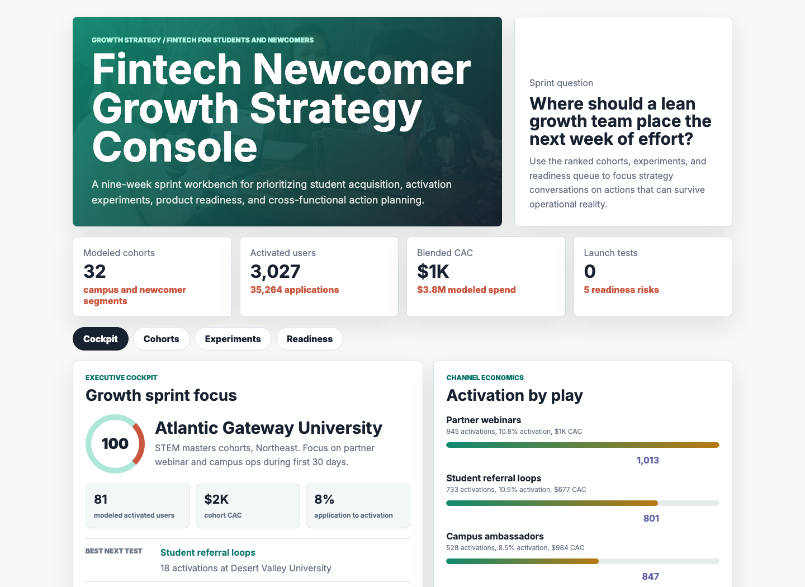
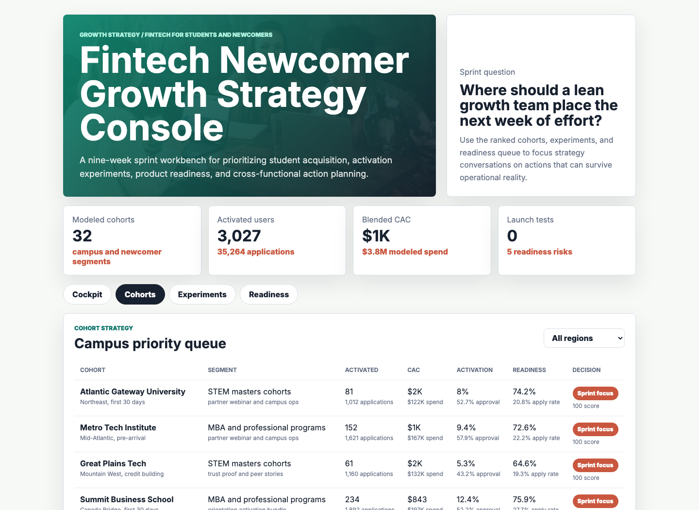
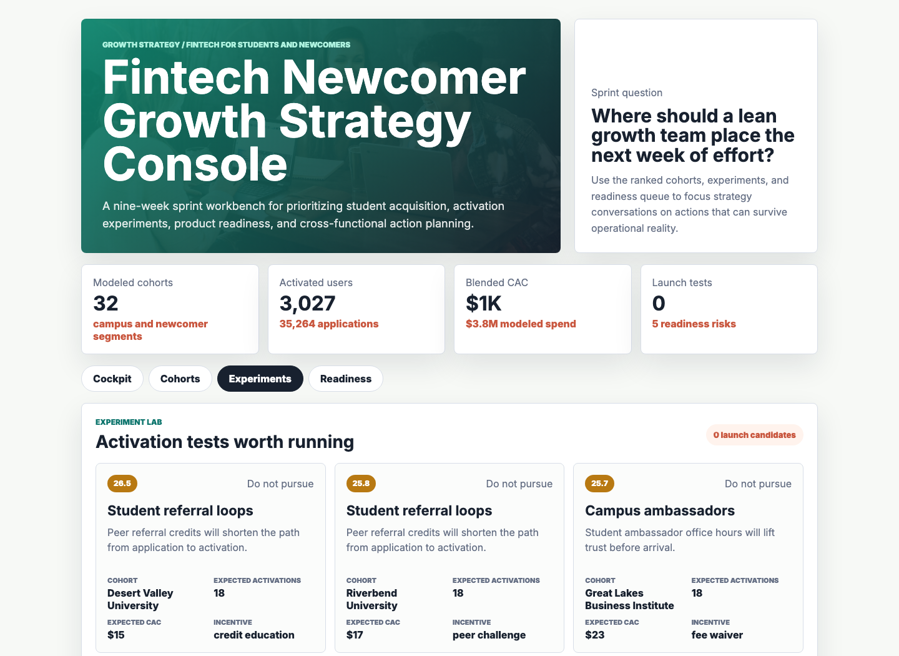
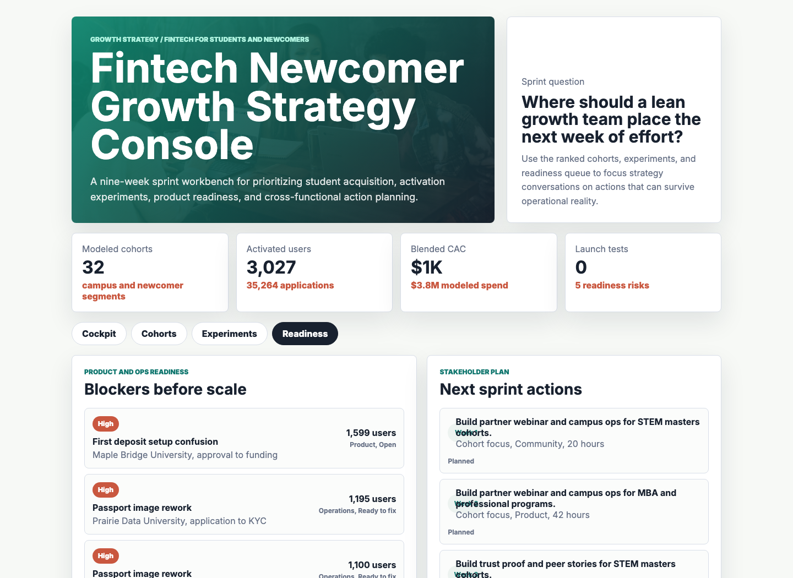

# Fintech Newcomer Growth Strategy Console

An interactive growth strategy artifact for a fintech team serving international students, new-to-country professionals, and other newcomers who need trusted banking and credit access before they have a long local financial history.

The console turns synthetic cohort, funnel, experiment, onboarding, and stakeholder-action data into a nine-week summer sprint plan. It is designed to show how a growth and strategy intern can size opportunities, prioritize experiments, coordinate with product and operations, and explain tradeoffs clearly.

## Screenshots



Caption: The cockpit summarizes the modeled sprint, highlights the highest-priority newcomer cohort, compares channel economics, and shows the weekly activation path.



Caption: The cohort queue ranks campus and newcomer segments by expected activation, CAC, readiness, funnel quality, decision status, and recommended focus.



Caption: The experiment lab converts growth ideas into launch decisions using expected activations, CAC, impact, confidence, ease, risk, and channel fit.



Caption: The readiness surface separates growth actions from product, support, risk, compliance, data, and RevOps blockers that must be cleared before scale.

## What This Project Demonstrates

- Growth strategy for a fintech product serving students and newcomers.
- Acquisition and activation funnel thinking across ambassadors, referrals, partner webinars, paid social, creator content, and search-led education.
- Experiment prioritization using expected activations, CAC, impact, confidence, ease, and operating risk.
- Product and operations readiness analysis across KYC, first deposit setup, virtual card education, support load, referral attribution, and data quality.
- Stakeholder communication for Growth, Community, Product, RevOps, Data, Operations, Compliance, and Risk teams.

## Data

The data is synthetic and generated with a fixed random seed by `scripts/score_operating_data.py`. It does not represent real company performance, real students, real campuses, real customers, partner records, credit outcomes, or private funnel analytics.

The synthetic structure is modeled on common workflows for a financial app serving students and newcomers:

- Campus and newcomer cohort sizing with addressable-student estimates, region, segment, start window, community density, partner fit, trust gap, product fit, compliance complexity, and cost index.
- Weekly funnel simulation across impressions, leads, applications, KYC starts, approvals, funded accounts, activated users, spend, support tickets, and KYC rework.
- Growth experiments across campus ambassadors, partner webinars, student referrals, creator content, paid social, and search-led education.
- Product readiness issues across onboarding, risk, compliance, support, data quality, and RevOps attribution.

Generation assumptions:

- Addressable cohort size uses a triangular distribution so most cohorts are mid-sized, with a few large campuses and program clusters.
- Conversion rates vary by community density, partner fit, trust gap, compliance complexity, product fit, channel type, and week of the sprint.
- CAC varies by channel base cost and regional cost index.
- Cohort priority combines opportunity size, activation rate, CAC efficiency, product readiness, partner fit, community density, trust risk, and compliance risk.
- Experiment priority combines expected activations, impact, confidence, ease, CAC, and readiness risk.

## Repository Structure

| Path | Purpose |
|---|---|
| `index.html` | Static app shell with four workbench surfaces. |
| `src/app.js` | Loads the analysis payload and renders tabs, tables, cards, charts, filters, and queues. |
| `src/styles.css` | Responsive workbench styling. |
| `scripts/score_operating_data.py` | Deterministic synthetic data generator and analysis builder. |
| `scripts/capture_screenshots.cjs` | Playwright screenshot capture for README images. |
| `data/` | Generated source-style CSV tables. |
| `analysis/outputs/` | Ranked queues, summary output, and app payload. |
| `analysis/executive_findings.md` | Stakeholder-style readout of the generated run. |
| `analysis/analysis_plan.md` | Analytical workflow and current generated summary. |
| `analysis/sql_checks.sql` | Example SQL checks for growth funnel reporting. |
| `docs/images/` | Rendered screenshots for the workbench surfaces. |

## Run Locally

```bash
npm run analyze
npm run start
```

Then open `http://localhost:4173/`.

If port `4173` is already in use, start the server on another port:

```bash
python3 -m http.server 4187
```

## Scope

This is a portfolio artifact, not a production growth system. It does not connect to live banking, underwriting, KYC, support, partner, CRM, data warehouse, or marketing systems. It does not process applications or make credit decisions.

It does show how a growth and strategy analyst can structure a defensible operating workflow for market prioritization, funnel diagnosis, experiment planning, product-readiness triage, and stakeholder-ready sprint recommendations in a fintech newcomer context.
